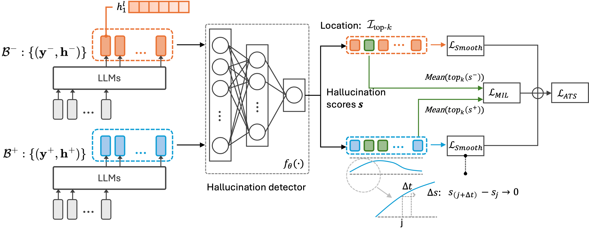

# HaMI


Official implementation for [***Robust Hallucination Detection in LLMs via Adaptive Token Selection***](https://arxiv.org/abs/2504.07863)


## Abstract
Hallucinations in large language models (LLMs) pose significant safety concerns that impede their broader deployment. 
Recent research in hallucination detection has demonstrated that LLMs' internal representations contain truthfulness hints, which can be harnessed for detector training. 
However, the performance of these detectors is heavily dependent on the internal representations of predetermined tokens, fluctuating considerably when working on free-form generations with varying lengths and sparse distributions of hallucinated entities.
To address this, we propose HaMI, a novel approach that enables robust detection of hallucinations through adaptive selection and learning of critical tokens that are most indicative of hallucinations. We achieve this robustness by an innovative formulation of the **Ha**llucination detection task as **M**ultiple **I**nstance (**HaMI**) learning over token-level representations within a sequence, thereby facilitating a joint optimisation of token selection and hallucination detection on generation sequences of diverse forms.
Comprehensive experimental results on four hallucination benchmarks show that HaMI significantly outperforms existing state-of-the-art approaches.


<p align="center">
  
</p>


## Requirements
```
conda env create -f requirements.yml
```

## Structure Guide

* `generation/generate_answers.py`: Get responses from the models for a set of input questions.
* `generation/evaluate_correctness.py`: Get the ground truth for generated responses.
* `generation/compute_entailment.py`: Get the semantic consistency identify for all samples for each question.
* `main.py`: Hallucination detector training and evaluation.
  

## Models Preparation

Our experiments rely on Hugging Face for all LLM models. Please apply for access to use the official repository for required LLMs.

* LLaMA: https://huggingface.co/meta-llama
* Mistral: https://huggingface.co/mistralai


## Run
By default, a standard run for Trivia QA data with LLaMA-3.1-8B executes the following four scripts in order:
### Generation
In this part, the code is partially built on the codebase for semantic uncertainty at https://github.com/jlko/semantic_uncertainty/tree/master.

* Get LLM generations

```
python generation/generate_answers.py --data_dir=your_data_dir --model_name=llama3_8b --data_name=trivia_qa
```

* Get the ground truth for the LLM generations

```
python generation/evaluate_correctness.py --data_dir=your_data_dir --model_name=llama3_8b --data_name=trivia_qa --eval_model=gpt-4.1
```

* Get semantic identity

```
python generation/compute_entailment.py --data_dir=your_data_dir --model_name=llama3_8b --data_name=trivia_qa
```

### Hallucination detection

```
python main.py --data_dir=your_data_dir --model_name=llama3_8b --data_name=trivia_qa --seed=42 --save_dir=results
```
* "model_name" denotes the LLM used for response generation.
* "data_name" denotes the dataset used for detector training.

Other parameters related to the results in our paper:
* "test_data_list" denotes the dataset used for detector evaluation.
* "mode" denotes the choice of representation augmentation.
* "b" denotes the strength of representation augmentation.
* "k_ratio" determines the number [k] for token selection.


### Citation
If you find this work helpful, please cite:
```bibtex
@article{niu2025robust,
  title={Robust Hallucination Detection in LLMs via Adaptive Token Selection},
  author={Niu, Mengjia and Haddadi, Hamed and Pang, Guansong},
  journal={arXiv preprint arXiv:2504.07863},
  year={2025}
}

```


